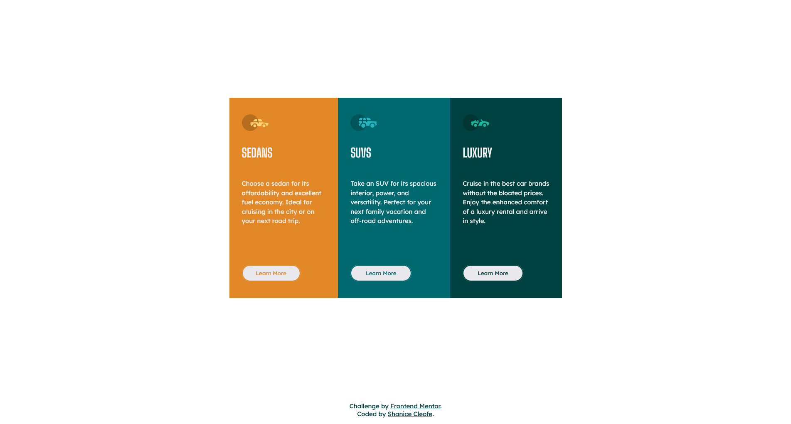

# Frontend Mentor - Stats preview card component solution

This is a solution to the [Stats preview card component challenge on Frontend Mentor](https://www.frontendmentor.io/challenges/stats-preview-card-component-8JqbgoU62). Frontend Mentor challenges help you improve your coding skills by building realistic projects.

## Table of contents

- [Overview](#overview)
  - [The challenge](#the-challenge)
  - [Screenshot](#screenshot)
  - [Links](#links)
- [My process](#my-process)
  - [Built with](#built-with)
  - [What I learned](#what-i-learned)
  - [Useful resources](#useful-resources)
- [Author](#author)

## Overview

### The challenge

Users should be able to:

- View the optimal layout depending on their device's screen size

### Screenshot

## Desktop Preview

---



## Mobile Preview

---


### Links

- Solution URL: [Frontend Mentor Solution]()
- Live Site URL: [Stats Preview Card Layout](https://sdacleofe.github.io/3-column-preview-card-component-main/)

## My process

### Built with

- Semantic HTML5 markup
- CSS custom properties
- FlexBox
- Sass
- StyleLint

### What I learned

Today, my coding has improved, resulting in cleaner and more legible code. I'm also gaining confidence in my proficiency with FlexBox and Sass.

```scss
@import 'breakpoint';

@media (max-width: $layout-breakpoint-medium) {
  body {
    main {
      article {
        flex-wrap: wrap;

        section {
          margin: 0 30px;

          button {
            width: 100% !important;
            color: red;
          }
        }

        section.sedan {
          margin-top: 20px;
        }

        section.luxury {
          margin-bottom: 20px;
        }
      }
    }
  }
}
```

### Useful resources

- [ChatGPT](https://www.example.com) - This helped me for finding answers to my questions. I really liked this pattern and will use it going forward.

## Author

- Website - [Shanice](https://github.com/sdacleofe/about-me)
- Frontend Mentor - [@sdacleofe](https://www.frontendmentor.io/profile/sdacleofe)
